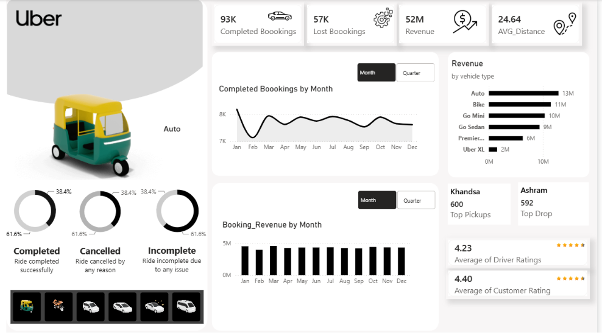

# 🚖 Uber Dashboard Analysis

# Project Overview
This project presents an interactive Power BI dashboard built using Uber trip data. It provides insights into bookings, revenue, customer experience, operational performance, and trip patterns.

##  Dashboard Preview

# Key Insights

-  Total Bookings: **93K**
-  Lost Bookings: **57K**
-  Total Revenue: **52M**
-  Highest Revenue Vehicle: **Auto (13M)**
-  Average Trip Distance: **24.64 km**
-  Average Driver Rating: **4.23**
-  Average Customer Rating: **4.40**

# Tools Used

- Microsoft Power BI
- Power Query
- DAX

# Dashboard Features

- Revenue Analysis
- Booking Trends
- Vehicle Type Comparison
- Customer Rating Analysis
- Driver Performance
- Trip Distance Analysis
- Interactive Filters & Slicers

##  Files Included

- dashboard 1 uber.pbix
- Dashboard.png
- README.md
-Uber Dashboard video

## 👨‍💻 Author

**Md. Saidul Islam Mridul**

Industrial & Production Engineering Student

Rajshahi University of Engineering & Technology (RUET)
